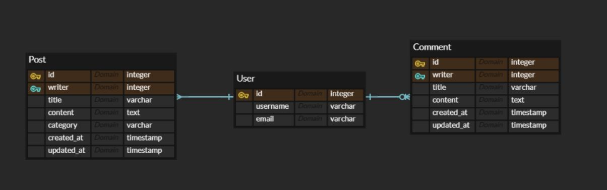

# :pushpin: YeChan-Kim

- 안녕하세요. 저는 중앙대학교 소프트웨어학부 20학번 김예찬입니다.  
- 멋사 12기 백엔드 개발자구요. :lion:
- MBTI는 ISTP입니다 :smile:  
- 1년동안 잘 부탁드립니다-!

</img>

4주차 db 스탠다드 과제입니다!

- Admin Page입니다-!
</img>

- ERD입니다-!
</img>

5주차 CRUD 스탠다드 과제입니다!

5주차 CRUD 챌린지 과제입니다!

